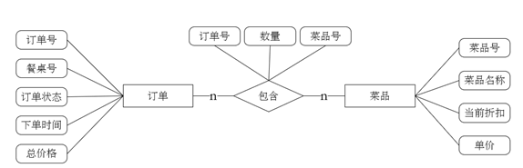
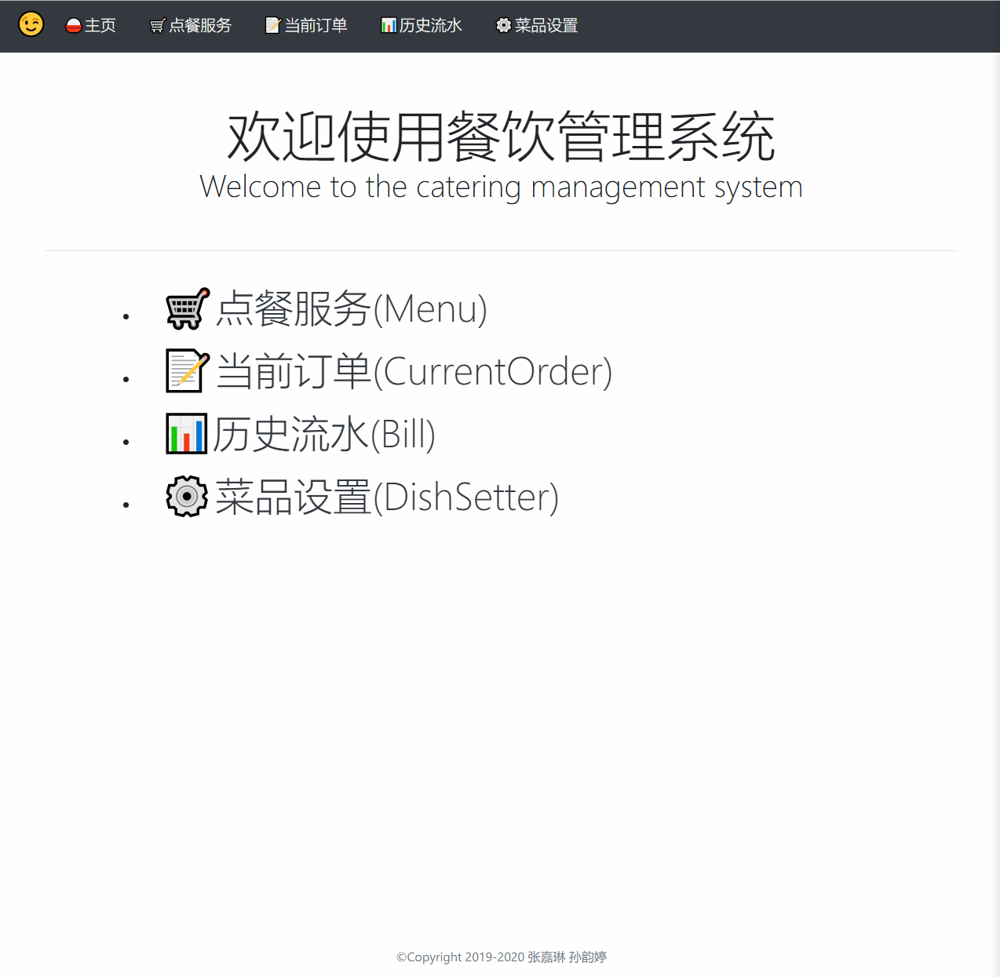
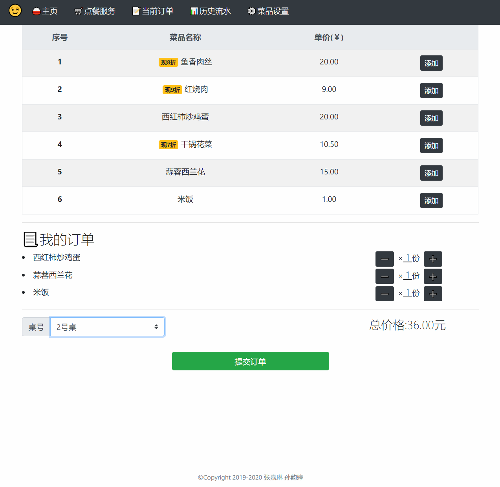
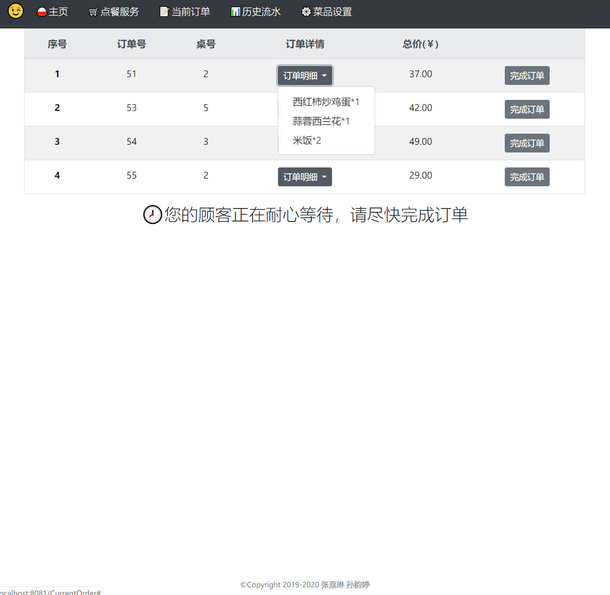
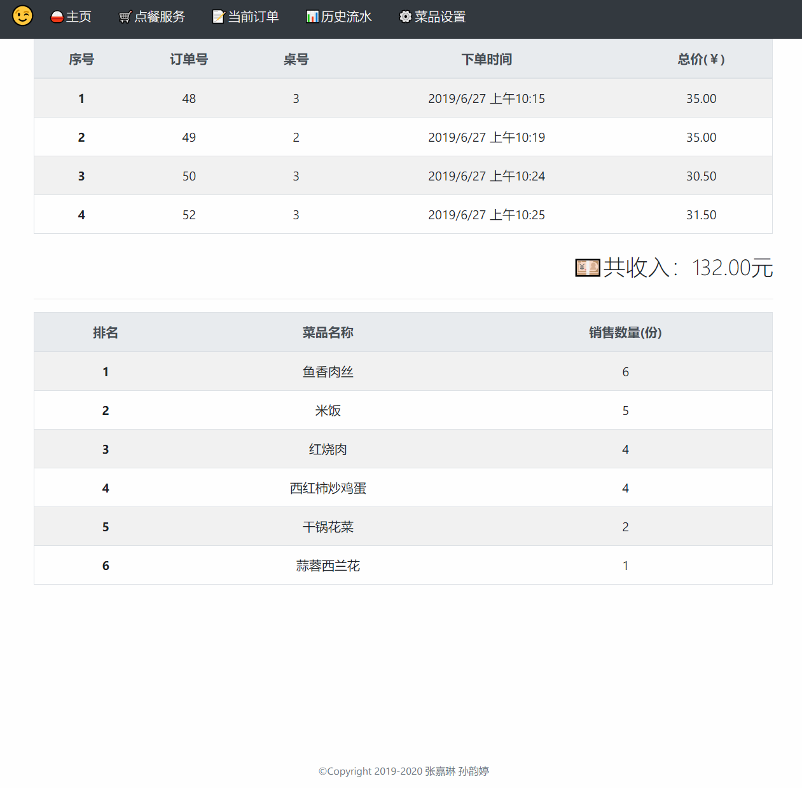
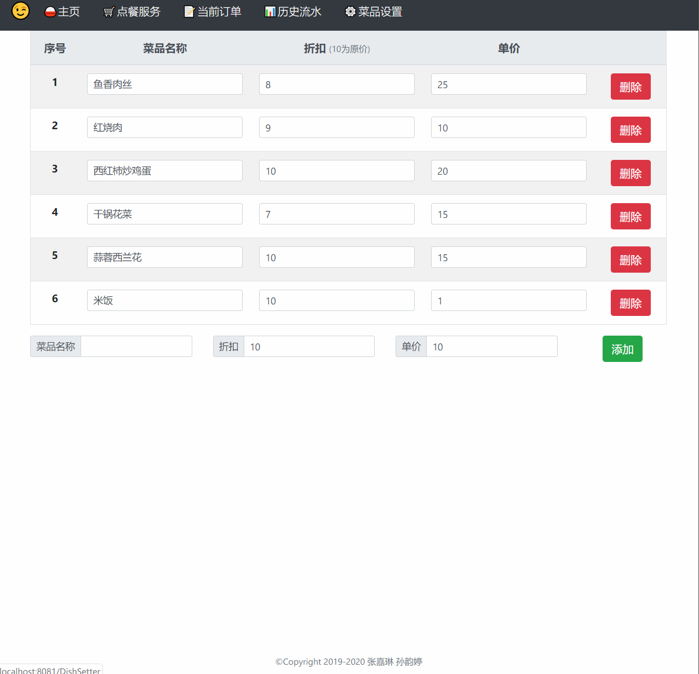

# Restaurant management system

> 通过客户的前台操作和餐厅管理者的后台操作来完成点餐系统

## 数据库设计

系统E-R模型图：

将E-R图转化为关系模式：

- **菜品**（菜品号，菜品名称，当前折扣，单价）
- **订单**（订单号，桌位号，订单状态，下单时间，总价格）
-  **点餐**（订单号，菜品号，数量）

## 开发环境：

- 前端
  - Bootstrap
  - Ngnix
  - Vue
  - Axios
  - Vue-router
  - 端口号:8081
- 后端
  - Springboot
  - Tomcat
  - 端口号：8080
- 其他
  - Postman：做接口测试
  - Jmeter：做压测

## 效果图

